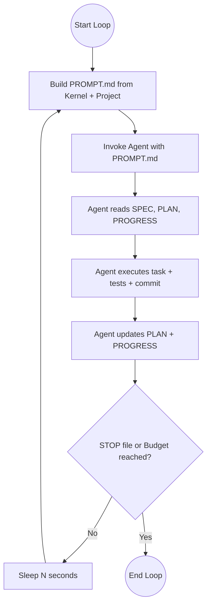

# Ralph Template

A reusable scaffolding for autonomous development loops using the **Ralph Loop** pattern—repeatedly invoking AI agents (like Claude Code) in non-interactive mode against a persistent context until completion.

## Core Concept

The Ralph Loop (named after the "Ralph Wiggum as a software engineer" pattern) treats the AI as a stateless worker.



Every iteration:
1. The runner concatenates a **Kernel** (generic rules) and **Project** (stack/conventions) prompt.
2. The agent reads the **Spec** (goal) and **Plan** (checklist).
3. The agent executes one task, updates the **Progress** log, and commits changes.
4. The loop continues until a `STOP` sentinel is created or budget limits are reached.

## Features

- **Language Agnostic:** Works with any stack (Python, Java, TypeScript, etc.).
- **Dual Runners:** Equivalent implementations in Bash (`ralph.sh`) and Python (`ralph.py`).
- **Just Integration:** Modern task runner support for initialization and cleanup.
- **Cost Controls:** Real-time token tracking and cumulative USD budget caps.
- **Circuit Breakers:** Automatically stops on consecutive failures or lack of progress.
- **Stateless Iterations:** Each run starts with a fresh process to prevent context drift.

## Quick Start

### Using `just` (Recommended)

1. **Initialize:** In your target repository:
   ```bash
   just --justfile /path/to/ralph-template/Justfile init
   ```
2. **Configure:** Fill in `ralph/PROJECT.md`, `ralph/SPEC.md`, and `ralph/PLAN.md`.
3. **Run:**
   ```bash
   ./ralph/ralph.sh --max 20 --max-total-cost 5.00 --dangerous
   ```

### Manual Setup

1. **Clone/Copy:** Drop the `ralph/` folder into your repository.
2. **Configure:**
   - Copy `PROJECT.md.template` to `PROJECT.md` and fill in your stack details.
   - Write your task goal in `SPEC.md` (based on `SPEC.md.template`).
   - Seed your initial checklist in `PLAN.md` (based on `PLAN.md.template`).
3. **Execute:**
   ```bash
   ./ralph/ralph.sh --max 20 --max-total-cost 5.00 --dangerous
   ```

## Repository Structure

- `ralph.sh` / `ralph.py`: The loop orchestration engines.
- `KERNEL.md`: The immutable "how to be an agent" instructions.
- `PROJECT.md`: Your local project's coding standards and build commands.
- `SPEC.md` / `PLAN.md`: The specific mission and execution checklist.
- `PROGRESS.md`: The append-only ledger of agent actions.
- `RALPH_GUIDELINES.md`: Operational best practices for autonomous loops.

## Credits

Based on the pattern pioneered by [Geoffrey Huntley](https://ghuntley.com/ralph/).
